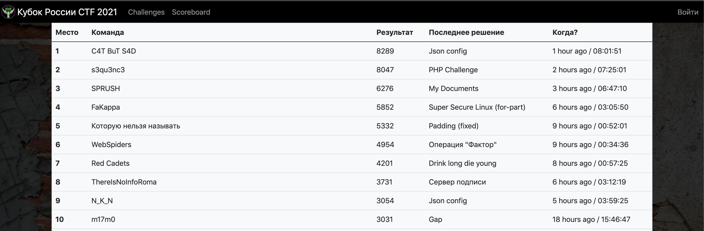

# Отборочный этап V Кубка CTF России

Исходные коды, разборы, эксплоиты и файлы для деплоя заданий с отборочного тура V Кубка CTF России, который проходил 20-21 ноября 2021 года в онлайн-формате.

[Сайт соревнований](https://ctfcup.ru/)

[CTF-Time](https://ctftime.org/event/1479)

## Задания

| Таск                                                                                     | Категория | Баллы | Кол-во решений | Автор |
| ---------------------------------------------------------------------------------------- | --------- | ----- | -------------- | ----- |
| [Private search](tasks/web/search-engine/README.md)                                     | web       | 500   | 11             | @jnovikov |
| [Personal Info Site](tasks/web/personal-site/README.md)                             | web       | 833   | 3              | @jnovikov |
| [PHP Challenge](tasks/web/phpchal/README.md)                                       | web       | 769   | 4              | @jnovikov |
| [PDF me](tasks/web/pdfme/README.md)                                                     | web       | 909   | 2              | @jnovikov |
| [Json config](tasks/web/json-config/README.md)                                           | web       | 909   | 2              | @jnovikov |
| [Gap](tasks/web/gap/README.md)                                                           | web       | 270   | 28             | @shipko |
| [Ultimate Password Protector](tasks/reverse/upp/README.md)       | reverse   | 303   | 24             | @thelothric | 
| [Super Secure Linux rev-part](tasks/reverse/SSL/README.md)   | reverse   | 1000  | 0              | @thelothric |
| [Solid Snake](tasks/reverse/solid-snake/README.md)                                       | reverse   | 909   | 2              | @thelothric |
| [Simple Protocol](tasks/reverse/simple-protocol/README.md)                               | reverse   | 909   | 2              | @thelothric |
| [Risky Business](tasks/reverse/risky/README.md)                                 | reverse   | 909   | 2              | @thelothric |
| [Kate](tasks/reverse/Kate/README.md)                                                     | reverse   | 909   | 2              | @thelothric |
| [Shell Batya](tasks/pwn/shell-batya/README.md)                                           | pwn       | 1000  | 1              | @thelothric |
| [Secure Notes 1](tasks/pwn/secure-notes-1/README.md)                                     | pwn       | 1000  | 1              | @thelothric |
| [Secure Notes 2](tasks/pwn/secure-notes-2/README.md)                                     | pwn       | 1000  | 0              | @thelothric |
| [Random Data Shop](tasks/pwn/rds/README.md)                                 | pwn       | 1000  | 0              | @thelothric |
| [My Documents](tasks/pwn/my-documents/README.md)                                         | pwn       | 455   | 13             | @thelothric |
| [Mnogoetazhka v1](tasks/pwn/mnogoetazhka-v1/README.md)                                   | pwn       | 714   | 5              | @thelothric |
| [Mnogoetazhka v2](tasks/pwn/mnogoetazhka-v2/README.md)                                   | pwn       | 1000  | 0              | @thelothric |
| [Utechka](tasks/forensics/Utechka/README.md)                                             | forensics | 667   | 6              | @thelothric |
| [Super Secure Linux for-part](tasks/forensics/SSL-stolen-files/README.md) | forensics | 909   | 2              | @thelothric |
| [Strange PDF](tasks/forensics/StrangePDF/README.md)                                     | forensics | 167   | 51             | @thelothric |
| [Simple Secure File System](tasks/forensics/SSFS/README.md)         | forensics | 714   | 5              | @thelothric |
| [Script Kiddie Attack](tasks/forensics/script-kiddie-attack/README.md)                   | forensics | 1000  | 0              | @thelothric |
| [Сервер подписи fixed](tasks/crypto/signature_server/README.md)                  | crypto    | 833   | 3              | @irina_otrada |
| [Сервер подписи](tasks/crypto/signature_server/README.md)                                  | crypto    | 500   | 11             | @irina_otrada | 
| [Операция "Фактор"](tasks/crypto/elliptic_curva/README.md)                            | crypto    | 417   | 15             | @greg0r0 |
| [x ^= y; y ^= x; x ^= y](tasks/crypto/xored/README.md)                  | crypto    | 127   | 70             | @greg0r0 |
| [Padding fixed](tasks/crypto/padding/README.md)                                | crypto    | 244   | 32             | @irina_otrada | 
| [Padding](tasks/crypto/padding/README.md)                                                | crypto    | 238   | 33             | @irina_otrada |
| [Drink long die young](tasks/OSINT/README.md)                       | OSINT     | 99    | 92             | @fun9ral |

## Результаты

[Полный список](scoreboard/full.png)

## Инфраструктура

- DevOps: [@Rubikoid](https://github.com/@Rubikoid)
- Checksystem: [yatb](https://github.com/kksctf/yatb)

